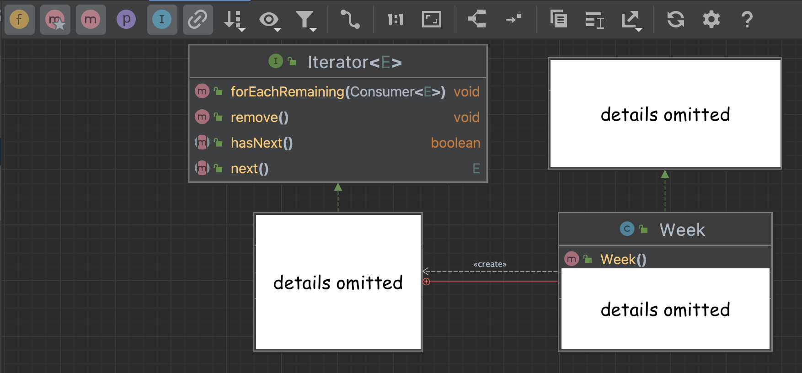

# IteratorCodingHomework

**Important: the last task asks you to generate and submit the git log for your repository — make sure to commit
your code as you complete each task, as you will be graded on having meaningful commits (at least one commit per task
and meaningful commit messages).**

**You are not required to use branches for this assignment**

## Task 1: Implementing Iterable

That for loop in method `main` is pretty awkward! It sure would be nice to be able to do this:
``` 
for (String day : week) {
     System.out.println(day);
}
```

- [ ] TODO: make that foreach loop syntax work by having class `Week` implement `Iterable<String>`.
            Once you implement this, run the tests in `WeekTest.java` and make sure those all pass.

Things to consider:

* Implementing `Iterable<String>` means you need an `iterator` method that returns a new `Iterator<String>`.

* You should define a nested `Iterator` class named `Iter`.

  * if you aren't sure how to get started on this, you can take a look at the source code for `ArrayList` and its `ArrayList.iterator()` method
    (either in IntelliJ or [online](https://github.com/AdoptOpenJDK/openjdk-jdk11/blob/master/src/java.base/share/classes/java/util/ArrayList.java)).
  * your code should have a similar structure, but will be much simpler than what you see in `ArrayList`.


## Task 2: Adding a test case

Method `Iterator.next` might throw an exception. This is from the
[online JavaDoc for method `next`](https://docs.oracle.com/en/java/javase/17/docs/api/java.base/java/util/Iterator.html#next()):

```
Throws:
NoSuchElementException - if the iteration has no more elements
```

- [ ] TODO: Add a test case in `WeekTest.java` to verify that a `NoSuchElementException` was thrown.

You can write tests for exceptions in several ways. This one below is pretty straightforward,
but feel free to do some reading and write this test using whichever approach you like.
**Make sure to use Junit4 for this, as that is what we will be running on MarkUs.**

```
try {
    // Write some code here that should throw an exception.
    // If one is thrown, the fail call won't be executed
    // because Java jumps to the catch block.

    fail("Expected NoSuchElementException but did not get one.");
} catch (NoSuchElementException e) {
    // Phew, we got the exception we expected. No need to do anything. The test passes!
}
```

## Task 3: Practice with UML generation

(Note: this requires IntelliJ Ultimate; you can run this on the lab machines if you haven't installed it)

With your completed code from Task 1, you will use IntelliJ to produce a UML class diagram which will look something
like the one shown below (with the details filled in of course!).

- [ ] TODO: reproduce the UML class diagram shown below (with the details filled in based on your code of course).
          Save a screenshot of the diagram in a file called `week-iterator-uml.png` in your `week8git` directory.
          There are some notes below to help you make sure it includes
          all the classes and interfaces in the diagram.



Tips:
* Right-click `Week.java` and in the context menu select `Diagrams -> Show Diagram...`
* You can then modify the diagram by toggling the various options. In the image above,
  note which options were selected to ensure the relevant information is shown.
* To add the interfaces to the diagram, you may need to right-click the box of the class
  that implements the interface in the diagram, select "Show Parents" and click on the name
  of the interface you want to add to the diagram.
* You can also drag the boxes around to orient them to be consistent with the image above.
* The red relationship arrow with the + sign in a circle denotes that the other class is an
  inner class defined inside the `Week` class.


## Task 4: Checking Code Coverage
Beside the run and debug buttons in IntelliJ, you will find another "play" button which, when you hover over it, will
say something like "Run with Coverage".

- [ ] TODO: run `WeekTest.java` with coverage and save a screenshot called `coverage.png` in your `week8git` directory.
The screenshot should show that the tests are achieving 100% coverage for `Week.java`.


## Task 5: Checking your `git log`
The `git log` command allows you to display a log of the commit history in your repository.
There are many optional arguments you can use to customize the output. Here, you will run the following:

`git log --stat > log.txt`

In this command:
* the `--stat` option changes how the output is displayed to give more information than just
running `git log`.
* the `> log.txt` says to write the output to a file called `log.txt`
  (you'll learn more about these kinds of commands in a course like CSC209 if you are interested).
  * You can also omit this part and see the output directly in the terminal.

- [ ] TODO: In the Terminal in IntelliJ, run `git log --stat > log.txt` and save the `log.txt` file in your `week8git` directory.

Make sure that it contains meaningful commit messages for each step of the process from the previous tasks
(not including this one). Feel free to remove the lines corresponding to previous homework commits, but it is
also fine to leave them in. If you are interested, we encourage you to look at the other options available when
you run [`git log`](https://git-scm.com/docs/git-log).

  * For example, the `--no-pager` argument in `git --no-pager log` tells git not to "page" the output
    (you can try running both `git log` and `git --no-pager log` to see the difference). By default, it will
    only show a "page" of output at a time, and you need to press Enter to view the next "page" or `q` to stop showing
    output.

And that's it! Make sure you have pushed all of your work to MarkUs and you are done.
